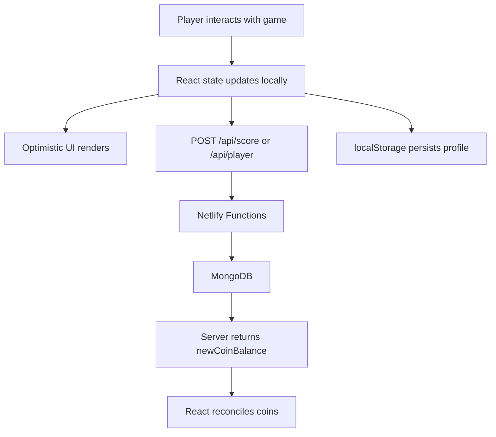

Wild Guess & Match is organized as a single-page React application with serverless backend functions. Understanding the data flow helps when adding features or debugging gameplay state.

## Frontend State

`src/App.tsx` is the top-level component that holds all shared state using React hooks. Every game mode is a child component that receives callbacks and read-only data from the parent.

```tsx
function App() {
  const [activeTab, setActiveTab] = useState<string>('guess');
  const [playerId, setPlayerId] = useState<string | null>(null);
  const [nickname, setNickname] = useState<string>('');
  const [avatarId, setAvatarId] = useState<string>('lion');
  const [coins, setCoins] = useState<number>(0);
  const [studioUnlocked, setStudioUnlocked] = useState<boolean>(false);
  const [savedPosters, setSavedPosters] = useState<string[]>([]);
  // ... audio mute states omitted for brevity
}
```

Each game mode receives event handlers like `onEarnCoins`, `onSavePoster`, and `onUnlockStudio`. The parent applies the change locally, persists it where needed, and then syncs with the backend.

## localStorage Keys

Several pieces of state survive page reloads through `localStorage`:

| Key | Type | Purpose |
| --- | --- | --- |
| `playerId` | string | Anonymous user identifier (e.g., `usr_xxxxxxxx`) |
| `nickname` | string | Display name shown in the leaderboard and header |
| `avatarId` | string | Selected animal avatar (default: `lion`) |
| `sfxMuted` | boolean | Whether sound effects are silenced |
| `musicMuted` | boolean | Whether the background synth loop is silenced |
| `savedPosters` | JSON string | Gallery of data URLs from the Drawing Studio |

Profile state is read from `localStorage` on mount. If `playerId` and `nickname` exist, the app skips the `ProfileSetup` gate and jumps directly into gameplay.

## API Flow

### Profile Load

When the app mounts with a stored `playerId`, it immediately fetches the latest profile from the server:

```tsx
fetch(`/api/player?playerId=${localId}`)
  .then((res) => res.json())
  .then((data) => {
    if (data.success && data.player) {
      setCoins(data.player.coins);
      setStudioUnlocked(data.player.studioUnlocked);
    }
  });
```

This rehydrates the local `coins` balance and unlock state in case they were modified by another device.

### Optimistic Coin Sync

When a player earns coins in Guess or Match mode, the client immediately updates the UI and then sends a score payload to the server:

```tsx
const handleEarnCoins = async (amount: number) => {
  // Optimistically update local coins balance
  setCoins((prev) => prev + amount);

  try {
    const res = await fetch('/api/score', {
      method: 'POST',
      headers: { 'Content-Type': 'application/json' },
      body: JSON.stringify({
        playerId,
        mode: activeTab,
        score: 1,
        coinsEarned: amount,
      }),
    });
    const data = await res.json();
    if (data.success && typeof data.newCoinBalance === 'number') {
      setCoins(data.newCoinBalance);
    }
  } catch (e) {
    console.error('Failed to sync score and coins:', e);
  }
};
```

The server validates and clamps `coinsEarned` per mode, then returns the authoritative balance. If the network request fails, the coin count remains at the optimistic value until the next successful sync.

### Profile Upsert

The `player` function accepts `POST /api/player` to create or update a profile document in MongoDB. It upserts with `playerId` as the unique key and sets `coins` and `studioUnlocked` only when explicitly provided:

```ts
await db.collection('players').findOneAndUpdate(
  { playerId },
  {
    $set: updateDoc,
    $setOnInsert: {
      playerId,
      coins: coins || 0,
      studioUnlocked: studioUnlocked || false,
      createdAt: new Date(),
    },
  },
  { upsert: true, returnDocument: 'after' }
);
```

## PWA Configuration

The app is built as a PWA using `vite-plugin-pwa` in `vite.config.ts`:

```ts
VitePWA({
  registerType: 'autoUpdate',
  includeAssets: ['favicon.svg', 'icons.svg', 'assets/**/*.svg'],
  manifest: {
    name: 'Wild Guess & Match',
    short_name: 'WildGuess',
    theme_color: '#FFDE4D',
    background_color: '#FFFDF5',
    display: 'standalone',
    orientation: 'portrait-primary',
  }
})
```

`registerType: 'autoUpdate'` means the service worker checks for updates automatically. The manifest configures the splash screen colors and forces portrait orientation on mobile.

## Netlify Redirects

`netlify.toml` defines three redirect rules:

1. `/api/leaderboard/daily` maps directly to the `leaderboard` function.
2. `/api/*` maps any other API path to a Netlify Function by the same name (`player`, `score`).
3. `/*` falls back to `index.html` for the single-page router.

```toml
[[redirects]]
  from = "/api/leaderboard/daily"
  to = "/.netlify/functions/leaderboard"
  status = 200

[[redirects]]
  from = "/api/*"
  to = "/.netlify/functions/:splat"
  status = 200

[[redirects]]
  from = "/*"
  to = "/index.html"
  status = 200
```

## Data Flow Diagram



## Component Hierarchy

```mermaid
flowchart TD
    App --> Layout
    App --> ProfileSetup
    Layout --> GuessGame
    Layout --> MatchGame
    Layout --> DrawingStudio
    Layout --> Leaderboard
    GuessGame --> soundSystem
    MatchGame --> soundSystem
    DrawingStudio --> soundSystem
    Leaderboard --> API[/api/leaderboard/daily]
    GuessGame --> API2[/api/score]
```

## Key Files

| File | Responsibility |
| --- | --- |
| `src/App.tsx` | Root state, profile loading, coin sync |
| `src/utils/sound.ts` | Web Audio synthesis and TTS |
| `src/utils/shuffle.ts` | Fisher-Yates shuffle for games |
| `src/data/animals.ts` | Animal registry with match objects and categories |
| `netlify/functions/player.ts` | Profile GET and POST |
| `netlify/functions/score.ts` | Score submission and coin validation |
| `netlify/functions/leaderboard.ts` | Daily leaderboard aggregation |
| `netlify/functions/utils/mongodb.ts` | Shared MongoDB client with connection caching |

## Next Steps

- [Game Features](/features/profiles): Explore how each game mode is implemented.
- [API Reference](/api/overview): See request and response shapes for every endpoint.
- [Testing & CI](/development/testing): Understand the Vitest and Playwright test suites.
